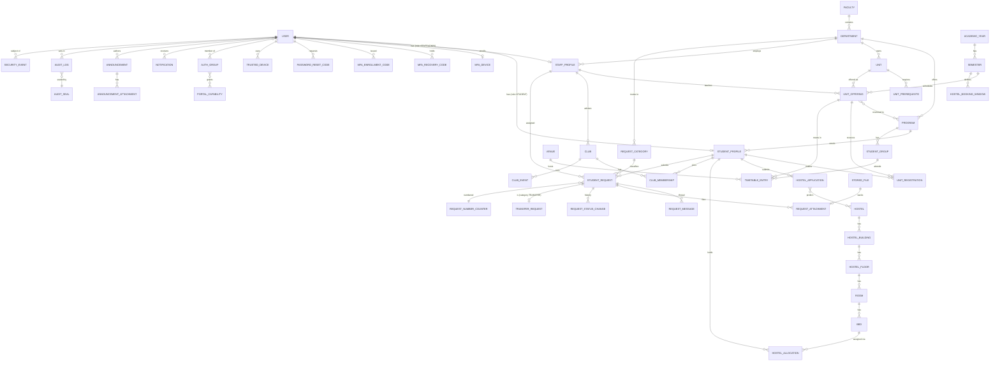

# Database Design

Status: **implemented (Phase 2)**. The provisional Phase 1 migrations were replaced by fresh initial migrations.

Implementation notes (deliberate, minor deviations from the design text below):
* Optional short text fields (`UnitRegistration.grade`, `StudentProfile.gender`) use `""` instead of NULL
  (Django convention); the CHECK constraints allow `""` or a value from the vocabulary.
* `HostelApplication.preferred_hostels` uses the through table `HostelPreference(application, hostel, rank)` with
  U(application, rank) and U(application, hostel).
* `UnitRegistration.registered_by` (nullable) records the admin who used a registration override.
* `HostelAllocation.ended_at` records when an allocation stopped holding its bed.
* `accounts.UserSession(session_key PK, user, created_at)` indexes each user's live session keys so all of a
  user's sessions can be ended at once (deactivation, MFA reset, password change) without scanning the session table.
* `seq` on append-only tables: PostgreSQL assigns it in a `BEFORE INSERT` trigger from a per-table sequence;
  other engines (development/test only) assign max+1 in the ORM.
* Append-only triggers allow mutation only in a deliberate maintenance session that sets
  `portal.audit_maintenance = 'on'` **and** connects as the table owner (migration role) — used by the test
  runner to flush tables; the runtime role can do neither.

Engine: PostgreSQL 16 (production, CI, concurrency tests). SQLite is allowed for quick local
development only; tests that depend on row locking are marked `postgres` and skipped on SQLite.

Conventions: UUID v4 primary keys (`id`), `created_at`/`updated_at` (UTC) on every mutable table,
`PROTECT` on foreign keys to institutional records, explicit status fields with `CHECK (status IN …)`
(Django `choices` + DB check constraint), soft deletion via `is_active` or terminal statuses — records
referenced by history are never hard-deleted.

## 1. Entity-relationship diagram

## 2. Tables

Notation: **PK** primary key · **FK→X (on_delete)** · **U** unique · **PU(cond)** partial unique ·
**CK** check constraint · **IX** index.

### 2.1 Accounts (`accounts`)

**User** — id PK; `username` (student/staff ID, login identifier) — U on `lower(username)`; `email` — U on `lower(email)`;
`first_name`, `last_name`; `role` CK ∈ {STUDENT, STAFF, ADMIN, SUPERADMIN}; `is_active`; `is_staff` (Django-admin flag; only meaningful in DEBUG
development where the stock admin may be mounted, see ARCHITECTURE D5); `is_superuser` **CK = false**; `date_joined`, `last_login`,
`password_changed_at`; `must_change_password` (bool); `created_at`, `updated_at`. IX(role, is_active).
*Lockout counters are **not** stored on the user row* (they live in the rate limiter — see ARCHITECTURE §4.1).

**StudentProfile** — id PK; `user` FK→User U (PROTECT — users are deactivated, never deleted);
institutional (read-only to students): `student_number` U, `program` FK→Program (PROTECT), `year_of_study` CK 1–8,
`current_semester_number` CK 1–3, `admission_date`, `expected_graduation` (nullable), `academic_status`
CK ∈ {ACTIVE, PROBATION, SUSPENDED, DEFERRED, GRADUATED, WITHDRAWN}, `disciplinary_status` CK ∈ {CLEAR, UNDER_REVIEW, SANCTIONED},
`campus`, `gender` (nullable; CK ∈ {FEMALE, MALE, OTHER}; collected only where hostel policy requires);
student-editable: `phone`, `personal_email`, `photo` FK→StoredFile (SET_NULL), `emergency_contact_name`,
`emergency_contact_phone`, `emergency_contact_relationship`. IX(program), IX(academic_status).

**StaffProfile** — id PK; `user` FK→User U; `staff_number` U; `department` FK→Department (PROTECT); `title`;
`office`; `phone` (visible to admins only); `is_lecturer` bool.

**MFADevice** — id PK; `user` FK→User U (one TOTP device); `secret_encrypted` (MultiFernet token); `confirmed_at`;
`last_used_step` bigint; `created_at`.

**MFARecoveryCode** — id PK; `user` FK→User; `code_hash` (HMAC-SHA256 with server pepper) U; `used_at` nullable. IX(user, used_at).
Consumed with a conditional `UPDATE … WHERE user_id = <pre-auth user> AND code_hash = … AND used_at IS NULL` (atomic single use, bound to the user).
**MFAEnrollmentCode** — id PK; `user` FK→User; `code_hash` (HMAC) U; `issued_by` FK→User (PROTECT); `expires_at`; `used_at` nullable.
**PasswordResetCode** — id PK; `user` FK→User; `code_hash` (HMAC) U; `expires_at`; `attempts` CK 0–5; `used_at` nullable;
`created_ip`. All unused codes for a user are invalidated on any password change.
**TrustedDevice** — id PK; `user` FK→User; `nonce_hash` U; `created_at`; `last_used_at`; `revoked_at`. Backs the signed
device cookie used by login throttling; all revoked on password change or MFA reset.

**PortalCapability** — permissions-only model (no rows); its `Meta.permissions` define the capability catalog
(ARCHITECTURE §5.2). Grants use Django's `auth_group`, `auth_group_permissions`, `accounts_user_groups`,
`accounts_user_user_permissions`.

### 2.2 Academics (`academics`)

**Faculty** — id; `code` U; `name`; `is_active`.
**Department** — id; `faculty` FK (PROTECT); `code` U; `name`; `is_active`.
**Program** — id; `department` FK (PROTECT); `code` U; `name`; `award_level` CK ∈ {CERTIFICATE, DIPLOMA, BACHELOR, MASTER, DOCTORATE};
`duration_years` CK 1–8; `max_credits_per_semester` CK 1–60; `min_credits_per_semester` CK ≥0 and ≤ max; `is_active`.
**AcademicYear** — id; `name` U (e.g. 2026/2027); `start_date`, `end_date` CK start < end; `is_current` PU(is_current) → at most one current.
**Semester** — id; `academic_year` FK (PROTECT); `number` CK 1–3; U(academic_year, number); `name`; `start_date`, `end_date` CK start<end;
`registration_opens_at`, `registration_closes_at` CK opens<closes; `add_drop_deadline`; `is_current` PU(is_current).
**Unit** — id; `department` FK (PROTECT); `code` U; `title`; `description`; `credit_hours` CK 1–10; `level` CK 1–8; `is_active`.
**UnitPrerequisite** — id; `unit` FK (CASCADE); `prerequisite` FK→Unit (PROTECT); U(unit, prerequisite); CK unit ≠ prerequisite.
(Cycle prevention validated in the service layer.)
**UnitOffering** — id; `unit` FK (PROTECT); `semester` FK (PROTECT); U(unit, semester, section); `section` (default "A");
`lecturer` FK→StaffProfile (SET_NULL, nullable); `capacity` CK ≥1; `eligible_programs` M2M→Program (empty = open to all);
`min_year` CK 1–8; `status` CK ∈ {DRAFT, OPEN, CLOSED, CANCELLED}.
**UnitRegistration** — id; `student` FK (PROTECT); `offering` FK (PROTECT); `unit` FK and `semester` FK (denormalised from the
offering, set only by the registration service; needed for the uniqueness rule below); `status` CK ∈ {REGISTERED, DROPPED, COMPLETED, FAILED, WITHDRAWN};
`grade` (nullable, CK in allowed grade set), `grade_points` decimal(3,2) nullable, `graded_by` FK→User nullable, `graded_at`;
`registered_at`, `dropped_at`. **PU(student, unit, semester) WHERE status IN (REGISTERED, COMPLETED)** — a student cannot hold two live
registrations for the same unit in one semester (also blocks registering sections A and B of the same unit). IX(offering, status), IX(student, status).

### 2.3 Timetable (`timetable`)

**Venue** — id; `code` U; `name`; `campus`; `building`; `capacity` CK ≥1; `venue_type`; `is_active`.
**StudentGroup** — id; `program` FK (PROTECT); `year_of_study` CK 1–8; `label` (e.g. "G1"); U(program, year_of_study, label).
**TimetableEntry** — id; `offering` FK (CASCADE); `semester` FK and `lecturer` FK nullable (denormalised from the offering; the
service that changes an offering's lecturer updates and re-validates its entries in the same transaction); `venue` FK (PROTECT); `day_of_week` CK 1–7 (Mon–Sun); `start_time`, `end_time`
**CK start_time < end_time**; `class_type` CK ∈ {LECTURE, TUTORIAL, LAB, WORKSHOP, EXAM}; `student_group` FK→StudentGroup nullable (PROTECT);
IX(venue, day_of_week), IX(offering).
Overlap protection, two layers:
1. Service validation (all engines) for venue, lecturer and student-group clashes, with readable messages.
2. PostgreSQL **exclusion constraints** (`btree_gist`), created by `RunSQL` in the migration, on
   `(semester =, day_of_week =, venue_id =, tsrange(DATE '2000-01-01' + start_time, DATE '2000-01-01' + end_time) &&)`,
   the same with `lecturer_id` (where not null) and with `student_group_id` (where not null) — these make
   concurrent clashing inserts impossible regardless of application locking.

### 2.4 Hostels (`hostels`)

**Hostel** — id; `code` U; `name` U; `campus`; `gender_policy` CK ∈ {MALE, FEMALE, MIXED}; `rules` (text); `is_active`.
**HostelBuilding** — id; `hostel` FK (PROTECT); `name`; U(hostel, name); `is_active`.
**HostelFloor** — id; `building` FK (PROTECT); `level` smallint; U(building, level).
**Room** — id; `floor` FK (PROTECT); `number`; U(floor, number); `room_type` CK ∈ {SINGLE, DOUBLE, TRIPLE, QUAD};
`capacity` CK 1–8; `status` CK ∈ {AVAILABLE, MAINTENANCE, CLOSED}; `fee_per_semester` decimal ≥0.
**Bed** — id; `room` FK (PROTECT); `label`; U(room, label); `status` CK ∈ {AVAILABLE, MAINTENANCE, CLOSED}.
Occupancy is **derived** (no `is_occupied` column).
**HostelBookingWindow** — id; `semester` FK; `mode` CK ∈ {APPLICATION, DIRECT_BOOKING}; `opens_at`, `closes_at` CK opens<closes;
`acceptance_hours` (time to accept an offer).
**HostelApplication** — id; `student` FK (PROTECT); `semester` FK (PROTECT); `preferred_hostels` M2M via ordered through-table
(`rank` CK 1–3); `preferred_room_type`; `special_needs` (text, visible only to student + `manage_hostels`);
`status` CK ∈ {SUBMITTED, UNDER_REVIEW, APPROVED, REJECTED, WAITLISTED, CANCELLED, ALLOCATED};
**PU(student, semester) WHERE status NOT IN (CANCELLED, REJECTED)**; `decided_by` FK→User; `decided_at`; `decision_note`.
Allocation/application transitions (all under the locks in §3):
offer (admin) → PENDING_ACCEPTANCE (application → ALLOCATED); accept → ACTIVE; decline → DECLINED (application → APPROVED, can be re-offered);
offer past `offer_expires_at` → EXPIRED (applied lazily inside any booking/offer transaction that touches the bed or student, and by a
periodic job) (application → APPROVED); student cancel → CANCELLED (application → CANCELLED); admin transfer → old TRANSFERRED + new ACTIVE;
check-out → VACATED.
**HostelAllocation** — id; `student` FK (PROTECT); `bed` FK (PROTECT); `semester` FK (PROTECT); `application` FK nullable;
`status` CK ∈ {PENDING_ACCEPTANCE, ACTIVE, DECLINED, EXPIRED, CANCELLED, TRANSFERRED, VACATED}; `offer_expires_at`;
`allocated_by` FK→User nullable (null = self-booked); timestamps.
**PU(bed, semester) WHERE status IN (PENDING_ACCEPTANCE, ACTIVE)** — one holder per bed per semester (race backstop).
**PU(student, semester) WHERE status IN (PENDING_ACCEPTANCE, ACTIVE)** — one bed per student per semester.

### 2.5 Clubs & societies (`clubs`)

**Club** — id; `kind` CK ∈ {CLUB, SOCIETY}; `code` U; `name` U; `category`; `description`; `advisor` FK→StaffProfile (SET_NULL);
`meeting_info`; `contact_email` (club address, not personal); `requires_approval` bool (default true); `is_active`.
**ClubMembership** — id; `club` FK (PROTECT); `student` FK (PROTECT); `status` CK ∈ {PENDING, APPROVED, REJECTED, LEFT, REMOVED};
`position` CK ∈ {MEMBER, SECRETARY, TREASURER, VICE_CHAIR, CHAIR}; `can_manage_members` bool (set only by a `manage_clubs` holder or the
club's advisor — never by a student, never on one's own membership);
`decided_by` FK→User; `decided_at`; **PU(club, student) WHERE status IN (PENDING, APPROVED)**.
**ClubEvent** — id; `club` FK; `title`; `description`; `starts_at` < `ends_at` CK; `location`; `visibility` CK ∈ {PUBLIC, MEMBERS}; `created_by` FK→User.

### 2.6 Requests & transfers (`student_requests`)

**RequestCategory** — id; `code` U; `name`; `description`; `department` FK nullable (routing); `default_priority`;
`requires_approval` bool; `approval_capability` CK ∈ {`approve_requests`, `approve_transfers`}; CK (`is_transfer` = false OR
`approval_capability` = 'approve_transfers'); CK (`is_transfer` = false OR `requires_approval` = true);
`allows_attachments` bool; `max_attachments` CK 0–10; `is_transfer` bool; `is_active`; `sort_order`.
Seeded: ACADEMIC_QUERY, UNIT_REGISTRATION_ISSUE, TRANSFER, HOSTEL_REQUEST, HOSTEL_TRANSFER, FEE_QUERY, STUDENT_ID,
TRANSCRIPT, PROGRAM_CHANGE, LEAVE, TECH_SUPPORT, GENERAL, OTHER.
**StudentRequest** — id; `number` U (format `REQ-YYYY-NNNNNN`, allocated from a per-year `RequestNumberCounter` row locked with `SELECT … FOR UPDATE`, portable to SQLite; displayed to users but never used as proof of authorization);
`student` FK (PROTECT); `category` FK (PROTECT); `subject` (≤200); `description` (≤10 000); `status`
CK ∈ {SUBMITTED, UNDER_REVIEW, NEEDS_INFORMATION, APPROVED, REJECTED, RESOLVED, CLOSED, CANCELLED};
`priority` CK ∈ {LOW, NORMAL, HIGH, URGENT}; `department` FK (copied from category at submission, changeable by reviewers);
`assigned_to` FK→StaffProfile nullable; `resolution` (text); `decided_by` FK→User nullable; `decided_at`; timestamps.
IX(student, status), IX(department, status), IX(assigned_to, status), IX(created_at).
**RequestMessage** — id; `request` FK (PROTECT); `author` FK→User (PROTECT); `body` (≤5 000); `visibility` CK ∈ {PUBLIC, INTERNAL};
`created_at`. Messages are immutable (no edit/delete).
**RequestAttachment** — id; `request` FK; `message` FK nullable; `file` FK→StoredFile (PROTECT); `uploaded_by` FK→User; `visibility`.
**RequestNumberCounter** — `year` PK; `last_value` bigint.
**RequestStatusChange** — id; `request` FK; `from_status`, `to_status`; `actor` FK→User; `note`; `created_at` (append-only).
**TransferRequest** — id; `request` FK→StudentRequest **U** (1:1); `transfer_type` CK ∈ {PROGRAM, DEPARTMENT, CAMPUS, FACULTY};
snapshots `from_program`, `from_department`, `from_campus`; targets `to_program` FK nullable, `to_department` FK nullable,
`to_campus` nullable (CK: exactly the target matching `transfer_type` is set); `reason`; `executed_at` nullable, `executed_by` FK nullable
(execution is once-only: service locks the row and checks `executed_at IS NULL`).

### 2.7 Notifications & announcements (`notifications`)

**Notification** — id; `recipient` FK→User (CASCADE); `kind` CK ∈ {REQUEST_STATUS, REQUEST_RESPONSE, HOSTEL, REGISTRATION, TIMETABLE,
CLUB, ANNOUNCEMENT, SECURITY, SYSTEM}; `title` (≤200); `body` (≤1 000, no sensitive data); `route_name` + `route_kwargs` JSON (resolved with `reverse()` at render time — no stored URLs, so no open redirect); `read_at` nullable; `created_at`. IX(recipient, read_at, created_at).
**Announcement** — id; `title`; `body`; `author` FK→User (PROTECT); `audience_roles` CK ∈ {EVERYONE, STUDENTS, STAFF} (who) combined with
`scope` CK ∈ {UNIVERSITY, FACULTY, DEPARTMENT, PROGRAM, OFFERING, CLUB, INDIVIDUAL} (where); `faculty`/`department`/`program`/`offering`/`club`
FK nullable — CK: exactly the FK required by `scope` is set; `recipients` M2M→User (INDIVIDUAL only). Example: "staff of department X only"
= (STAFF, DEPARTMENT, X); `publish_at`, `expires_at` CK publish<expires; `status` CK ∈ {DRAFT, PUBLISHED, WITHDRAWN}.
**AnnouncementAttachment** — id; `announcement` FK; `file` FK→StoredFile.

### 2.8 Core (`core`)

**StoredFile** — id; `storage_name` (random, server-generated, U); `original_name` (sanitised, display only, ≤150); `content_type`
(sniffed); `size` CK > 0; `sha256`; `owner` FK→User (PROTECT); `purpose` CK ∈ {PROFILE_PHOTO, REQUEST_ATTACHMENT, ANNOUNCEMENT_ATTACHMENT};
`scan_status` CK ∈ {NOT_SCANNED, CLEAN, INFECTED}; `created_at`.
**AuditLog** — id; `seq` bigint U (monotonic); `timestamp`; `actor` FK→User (PROTECT — users are never deleted; `actor_identifier`/`actor_role` cached); `action`; `object_type`;
`object_id`; `changes` JSON (`{"before": {…}, "after": {…}}`, secrets never included); `ip_address`; `user_agent` (≤256); `request_id`;
`outcome` CK ∈ {SUCCESS, DENIED, FAILED}. IX(timestamp), IX(actor, timestamp), IX(object_type, object_id), IX(action, timestamp).
**SecurityEvent** — id; `timestamp`; `event_type`; `user` FK nullable (PROTECT); `identifier_hash` (HMAC of the attempted identifier —
lets analysts correlate attempts without storing what was typed); `ip_address`; `user_agent`; `path`; `details` JSON (redacted).

**Append-only enforcement for AuditLog, SecurityEvent, RequestStatusChange, AuditSeal:**
1. ORM: model `save()` refuses updates, `delete()` refuses; custom QuerySet `update()`/`delete()` raise.
2. PostgreSQL trigger `BEFORE UPDATE OR DELETE … FOR EACH ROW EXECUTE FUNCTION forbid_mutation()` (and `BEFORE TRUNCATE`).
3. Privileges: runtime role `portal_app` has only `SELECT, INSERT` on these tables.
4. Tamper evidence: a scheduled job writes **AuditSeal** rows (`stream` ∈ {AUDIT, SECURITY, REQUEST_HISTORY}, `from_seq`, `to_seq`,
   `sha256` over the canonical JSON of every row in the range chained with the previous seal's hash, `created_at`) and emits each
   seal to the external log stream. Because rows from two connections (D16) can commit out of `seq` order, a seal only covers rows
   whose `timestamp` is older than a 15-minute grace window, and PostgreSQL `idle_in_transaction_session_timeout`/`statement_timeout`
   (5 min) guarantee no transaction holding an older `seq` is still open; the next seal starts at the first unsealed `seq` and the
   verifier re-hashes exactly the rows present in each range (a later-appearing row inside a sealed range is reported as tampering).
   SecurityEvent and RequestStatusChange therefore also carry `seq`. A DBA who disables the trigger and edits rows
   breaks the seal chain, which `manage.py verify_audit_seals` detects. (Periodic seals avoid serialising every audited write.)
Retention/archival, if ever required, is a documented DBA procedure under the owner role, outside the application.

## 3. Transactions & locking

| Operation | Locks (in order, to avoid deadlocks) | DB backstop |
|---|---|---|
| Unit registration | `StudentProfile` row → `UnitOffering` row (`SELECT … FOR UPDATE`) | PU(student, unit, semester) live; capacity and credit load re-counted under lock |
| Unit drop | `StudentProfile` row → registration row | min-credit rule re-checked under lock |
| Bed booking / offer / accept / decline / cancel / expire | `StudentProfile` row → `Bed` row → allocation row (and application row) | PU(bed, semester) active; PU(student, semester) active; expired offers marked EXPIRED inside the lock before the availability check |
| Allocation transfer | both bed rows in UUID order → allocation row | same partial uniques |
| Request transition | `StudentRequest` row | CK on status |
| MFA recovery / reset code use | — (single conditional UPDATE) | `used_at IS NULL` predicate |
| Transfer execution | `StudentRequest` row → `TransferRequest` row → `StudentProfile` row | under lock: request status = APPROVED, `executed_at IS NULL`, student's current program/department/campus still equal the `from_*` snapshot |
| Role/group/capability/activation change | all active SUPERADMIN `User` rows (ordered by id) → target `User` row | CK is_superuser=false; ≥1 active SUPERADMIN with `manage_roles` re-checked under lock |
| Timetable entry save / offering lecturer change | `Venue` row → lecturer `StaffProfile` row → offering row | CK start<end; exclusion constraints (PostgreSQL) |

`IntegrityError` from a backstop constraint is translated into a user-facing validation message (never a 500).

## 4. Migration policy

Schema changes only via Django migrations committed to git, applied by the `portal_owner` role during deployment
(`manage.py migrate` with owner credentials), never by hand on production. Data migrations seed the capability
catalog, default groups and request categories. Each migration is reviewed for locking impact on large tables.
